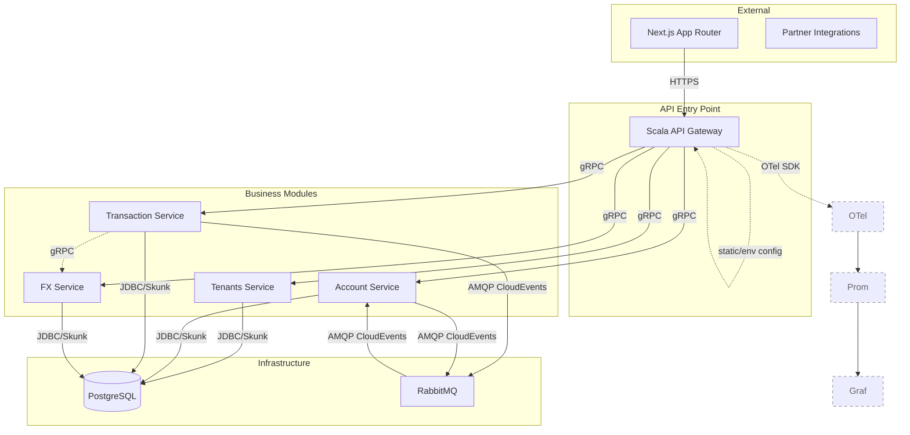

# C4 — Containers

```mermaid
flowchart TB
  %% Classes
  classDef roadmap stroke-dasharray: 5 5,stroke:#888,color:#666;

  subgraph External
    FE[Next.js App Router]
    Partners[Partner Integrations]
  end

  subgraph API[API Entry Point]
    Gateway[Scala API Gateway]
  end

  subgraph Modules[Business Modules]
    Tenants[Tenants Service]
    Account[Account Service]
    Transaction[Transaction Service]
    FX[FX Service]
  end

  subgraph Infra[Infrastructure]
    PG[(PostgreSQL)]
    RMQ[RabbitMQ]
  end

  %% External to API
  FE -->|HTTPS| Gateway
  Gateway -->|gRPC| Tenants
  Gateway -->|gRPC| Account
  Gateway -->|gRPC| Transaction
  Gateway -->|gRPC| FX

  %% Messaging (CloudEvents)
  Transaction -->|AMQP CloudEvents| RMQ
  RMQ -->|AMQP CloudEvents| Account
  Account -->|AMQP CloudEvents| RMQ

  %% Persistence
  Tenants -->|JDBC/Skunk| PG
  Account -->|JDBC/Skunk| PG
  Transaction -->|JDBC/Skunk| PG
  FX -->|JDBC/Skunk| PG

  %% Service Discovery
  Gateway -. static/env config .-> Gateway

  %% Observability (roadmap)
  Gateway -. OTel SDK .-> OTel
  OTel --> Prom
  Prom --> Graf

  %% FX Provider SPI
  Transaction -. gRPC .-> FX

  %% Style roadmap elements
  class OTel,Prom,Graf roadmap;
```
