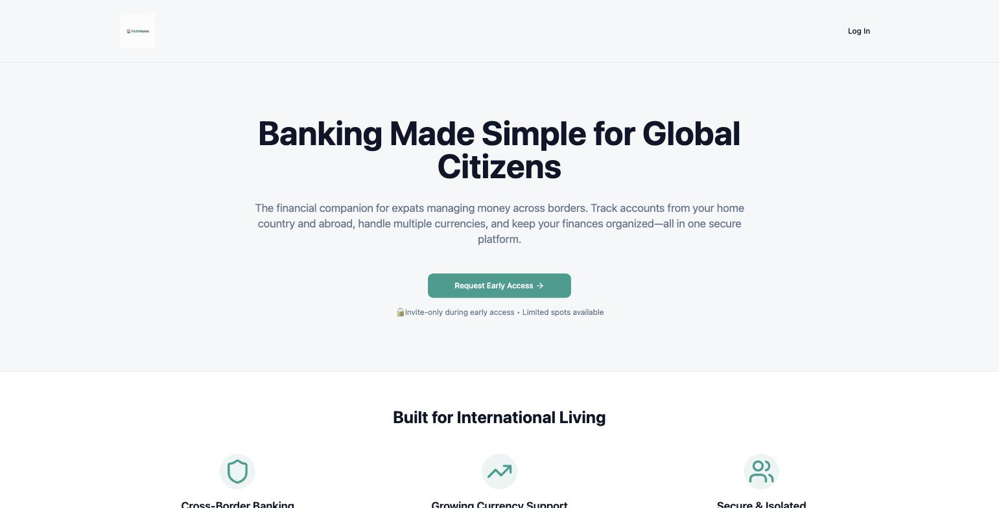
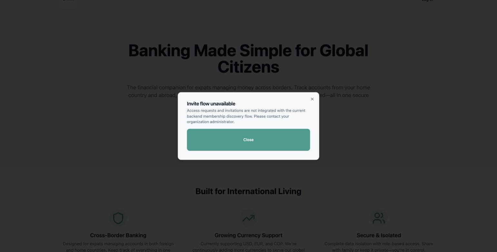
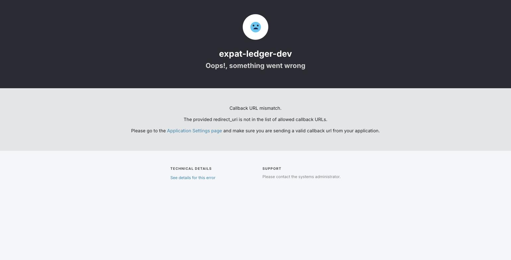
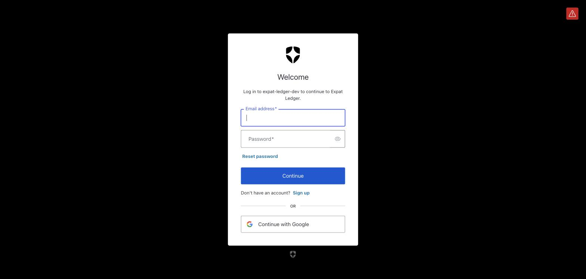
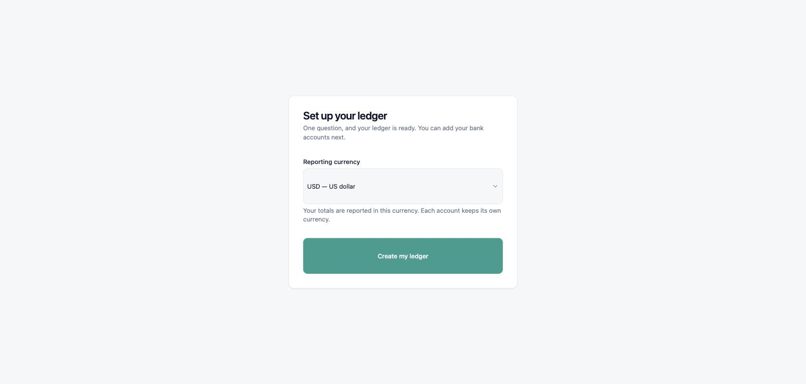
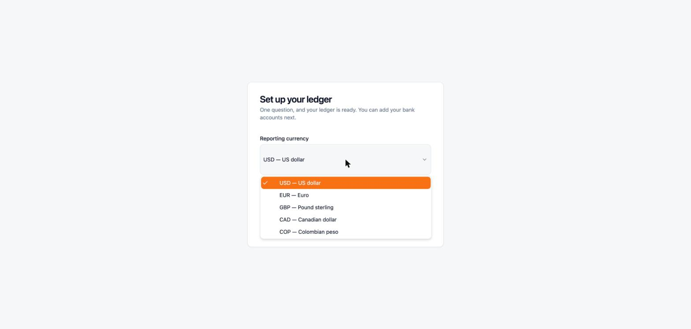
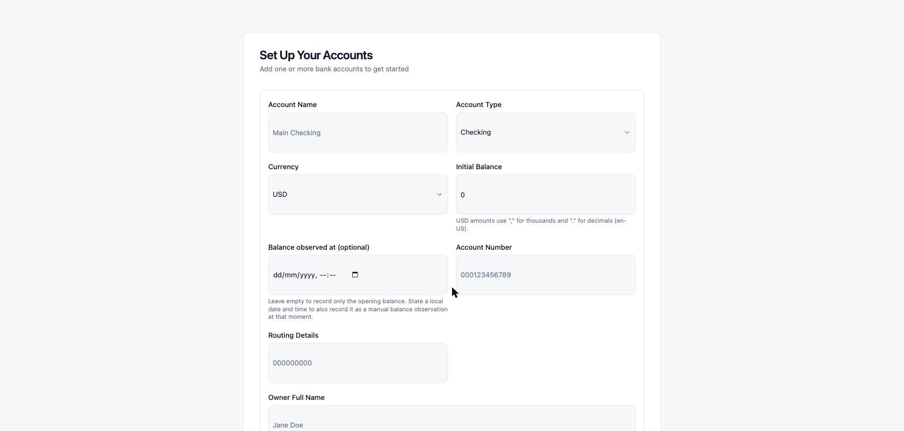
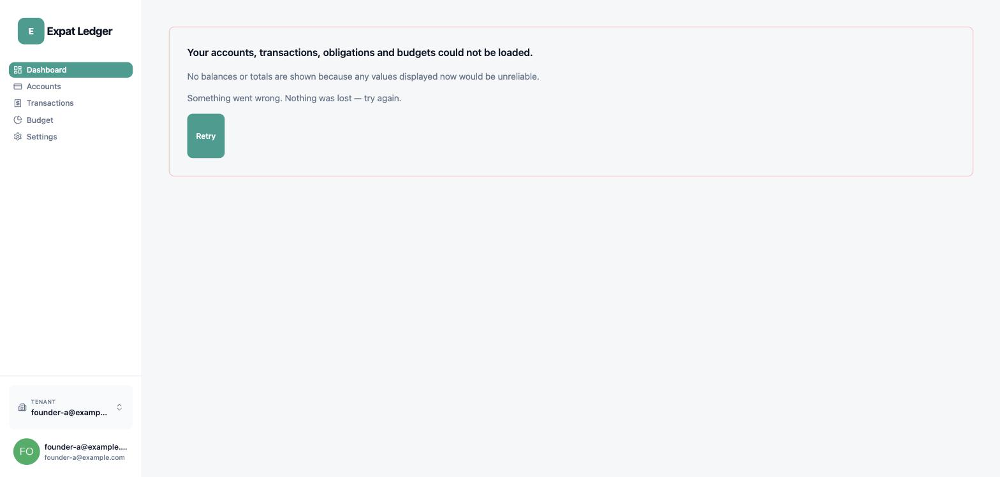
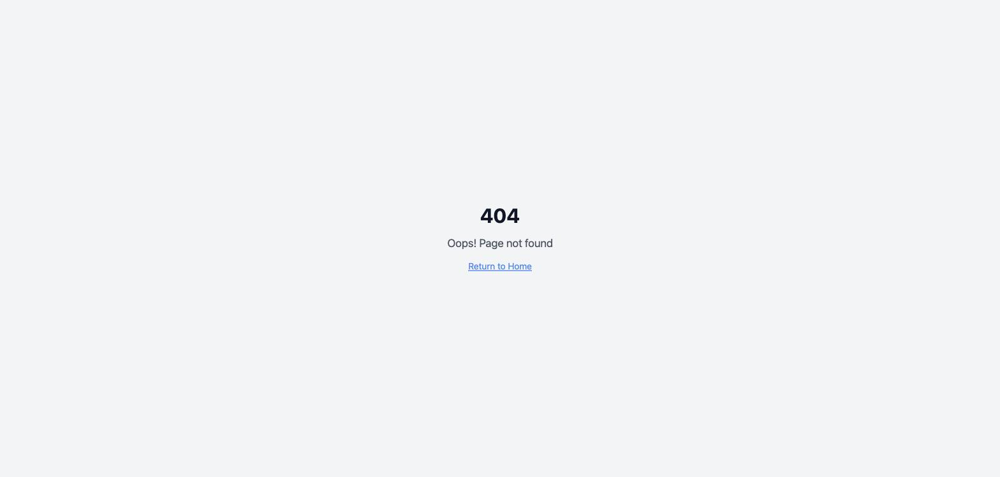

# Founder test — Start your ledger, end to end

| | |
| --- | --- |
| **Date walked** | 2026-08-20 |
| **Feature** | `start-your-ledger` |
| **Run kind** | Founder test |
| **Protocol** | [expat-ledger-frontend#142](https://github.com/alexandervivas/expat-ledger-frontend/issues/142) |
| **Environment** | Local stack on macOS, clean `git worktree`, Auth0 development tenant |
| **Identities** | Synthetic only — reserved `example.com` addresses and placeholder account data |

## Verdict

> **No** — a new user today can start their ledger and sign in, and their data
> really is theirs alone, but they cannot yet see the ledger they just created,
> because the first screen after onboarding is an error rather than their own
> empty position.

The walk is complete. Eleven findings were filed, nine of which became blockers
of the protocol issue; it closes only when they are resolved and the flow is
walked again from a clean checkout. That re-walk gets its own dated folder in
the [register](../index.md) — these images are not replaced.

## What held

Tenant isolation passed, and passed well: a caller sees only their own tenant,
and a cross-tenant probe is refused with wording indistinguishable from
non-existence, so there is no enumeration oracle. Sign-up, sign-in, sign-out and
re-entry all work, onboarding is genuinely one question, and the dashboard
refuses to invent zeros when it cannot trust its reads.

## The walk

### 1. Landing page — the public front door

Evidences [#151](https://github.com/alexandervivas/expat-ledger-frontend/issues/151):
the product names itself **PathHome** publicly and **Expat Ledger** once you are
inside. The primary call to action is "Request Early Access" rather than a
sign-up, which sets up the next finding.

### 2. The primary CTA dead-ends

Evidences [#146](https://github.com/alexandervivas/expat-ledger-frontend/issues/146):
the front door refuses the user, while a working sign-up sits behind "Log In".
The same frame also evidences
[#148](https://github.com/alexandervivas/expat-ledger-frontend/issues/148) —
"Currently supporting USD, EUR, and COP", two short of what the product
offers — and
[#92](https://github.com/alexandervivas/expat-ledger-frontend/issues/92), whose
"Share with family" and role-based-access claims describe multi-user tenancy
that does not exist.

### 3. The documented Auth0 setup does not reach a working login

Evidences [#152](https://github.com/alexandervivas/expat-ledger-frontend/issues/152)
and answers the protocol's "or a finding records exactly where the documentation
failed". The configured client id named a **confidential** application rather
than a single-page one; an M2M application has no allowed callback URLs, so
Auth0 refused the redirect. Nothing detects this at startup — it surfaces only
here, as a dead end.

### 4. Universal Login — the delegated authentication boundary

Not a defect. Recorded because it marks the boundary the product deliberately
does not own: credential failures stop here, at Auth0. The product's obligation
is the integration seam, and that seam is where the failures were found —
[#145](https://github.com/alexandervivas/expat-ledger-frontend/issues/145), the
app never reads the Auth0 error, so a failed login looks like a dead button.

### 5. Onboarding asks one question

Not a defect: this is the promise being kept. One question, and the ledger is
provisioned self-service.

### 6. Five currencies, not three

The proof half of
[#148](https://github.com/alexandervivas/expat-ledger-frontend/issues/148): the
product supports **five** currencies while the landing copy claims three in four
separate places. The product undersells itself.

### 7. Account setup

No finding — the step is recorded to keep the walk continuous. Every value shown
is a form placeholder, not entered data.

### 8. The first screen a new user actually gets

The headline. Evidences
[#143](https://github.com/alexandervivas/expat-ledger-frontend/issues/143): the
accounts read returned an empty ledger successfully and was thrown away because
the transactions read failed —
[backend#235](https://github.com/alexandervivas/expat-ledger-backend/issues/235),
a route declared in the contract that the gateway never registers.

Two further findings are visible in the same frame:
[#144](https://github.com/alexandervivas/expat-ledger-frontend/issues/144), the
five sidebar links of which four go nowhere, and
[#150](https://github.com/alexandervivas/expat-ledger-frontend/issues/150), the
account menu trigger that has no accessible name — WCAG 2.1 AA 4.1.2, on the
only route to sign-out.

The error copy itself is right, and worth preserving as the counter-example:
"No balances or totals are shown because any values displayed now would be
unreliable" is the product refusing to invent zeros.

### 9. Four of five sidebar links eject the user

Evidences [#144](https://github.com/alexandervivas/expat-ledger-frontend/issues/144):
the user is ejected from the application shell entirely, with nothing but
"Return to Home" to get back.

## Findings filed from this run

| Finding | Kind | Evidenced by |
| --- | --- | --- |
| [#143](https://github.com/alexandervivas/expat-ledger-frontend/issues/143) — one failing read blanks the whole dashboard | Defect | 08 |
| [#144](https://github.com/alexandervivas/expat-ledger-frontend/issues/144) — four of five sidebar links route nowhere | Defect | 08, 09 |
| [#145](https://github.com/alexandervivas/expat-ledger-frontend/issues/145) — Auth0 redirect errors silently discarded | Defect | 04 (seam), 03 (symptom) |
| [#146](https://github.com/alexandervivas/expat-ledger-frontend/issues/146) — primary CTA dead-ends in "Invite flow unavailable" | Defect | 02 |
| [#147](https://github.com/alexandervivas/expat-ledger-frontend/issues/147) — Auth0 `sub` and tenant id survive sign-out | Defect | not visual |
| [#148](https://github.com/alexandervivas/expat-ledger-frontend/issues/148) — currency copy understates by two | Defect | 02, 06 |
| [#150](https://github.com/alexandervivas/expat-ledger-frontend/issues/150) — account menu trigger has no accessible name | Defect | 08 |
| [#151](https://github.com/alexandervivas/expat-ledger-frontend/issues/151) — public name is PathHome, product name is Expat Ledger | Issue | 01 |
| [#152](https://github.com/alexandervivas/expat-ledger-frontend/issues/152) — documented Auth0 setup does not reach a working login | Issue | 03 |
| [#92](https://github.com/alexandervivas/expat-ledger-frontend/issues/92) — landing markets multi-user tenancy that does not exist | Defect | 02 |
| [backend#235](https://github.com/alexandervivas/expat-ledger-backend/issues/235) — `GET /v1/transactions` unrouted in the gateway | Defect | 08 (cause) |

## Privacy

Every image was reviewed against the
[archive's privacy rules](../../governance/evidence-archive.md#rules) before it
was committed. No real name, email address, balance, account number or statement
content appears in any of them: the signed-in identity is a reserved
`example.com` address, and the account form's values are placeholders rather than
entered data.

**Three further screenshots from this session were deliberately excluded**
because they carried the walker's real name, email address, or password-manager
entries. They are not to be added later, and their absence is why the walk skips
directly from sign-in to onboarding.
