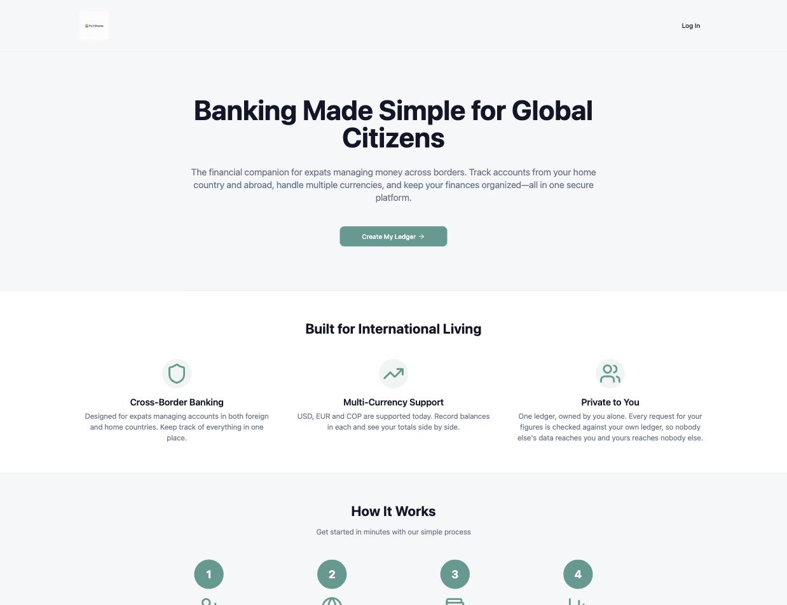
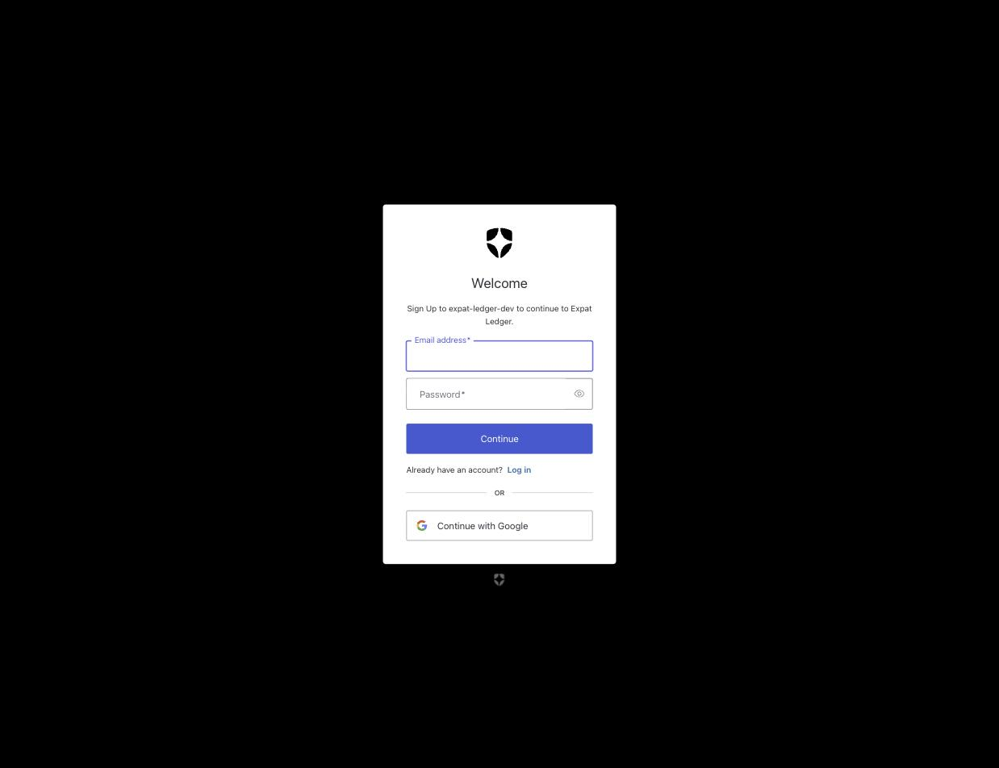
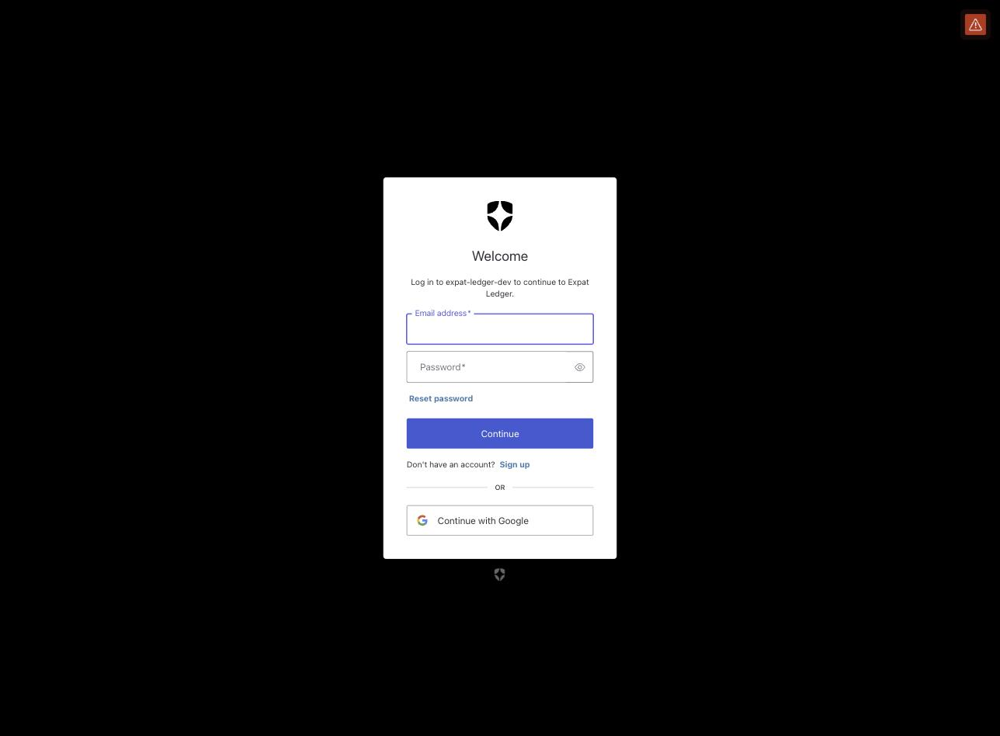
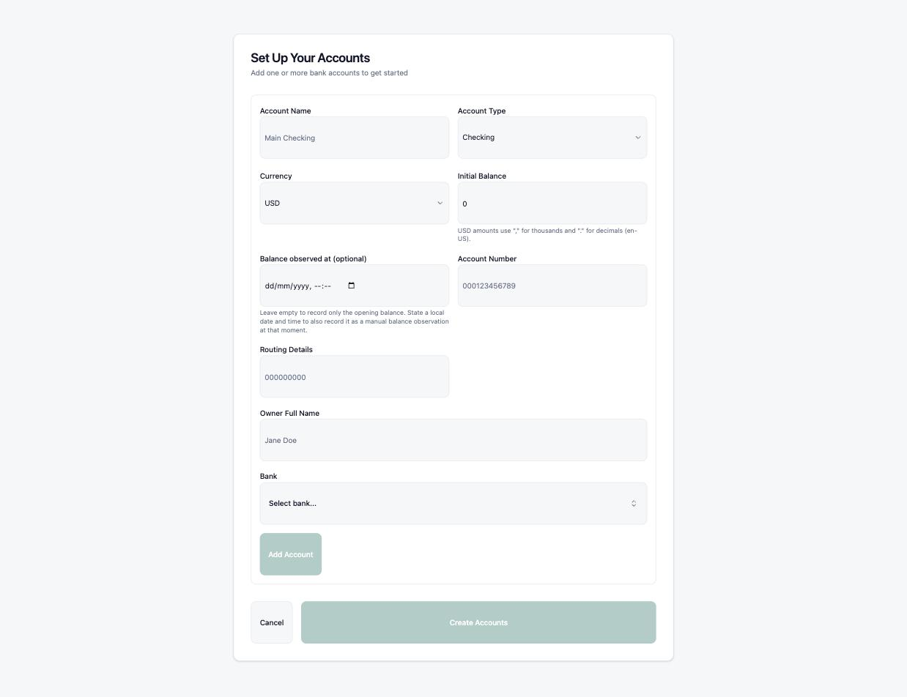
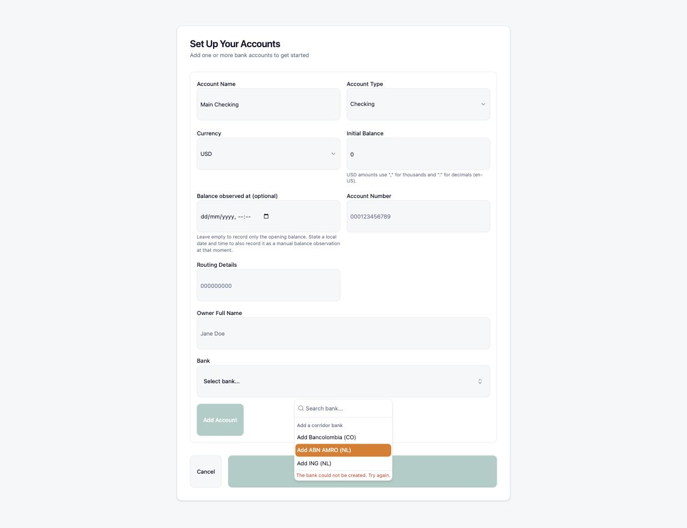
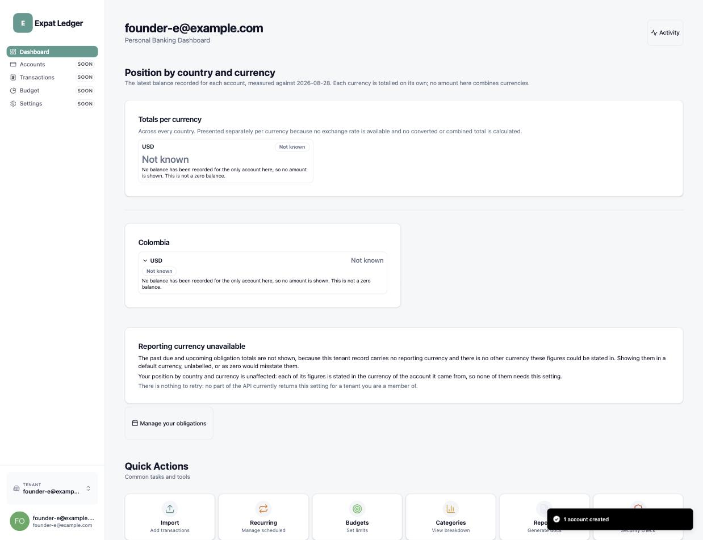
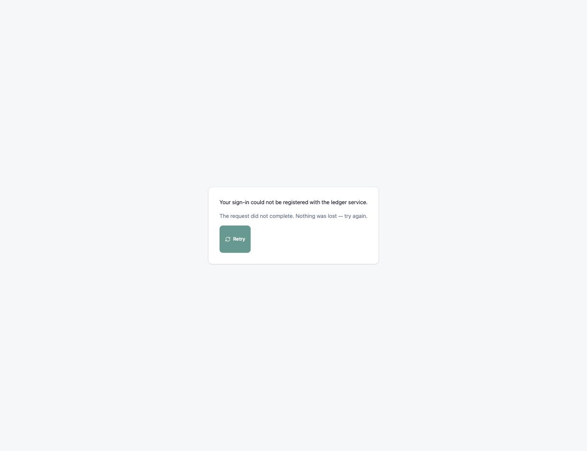
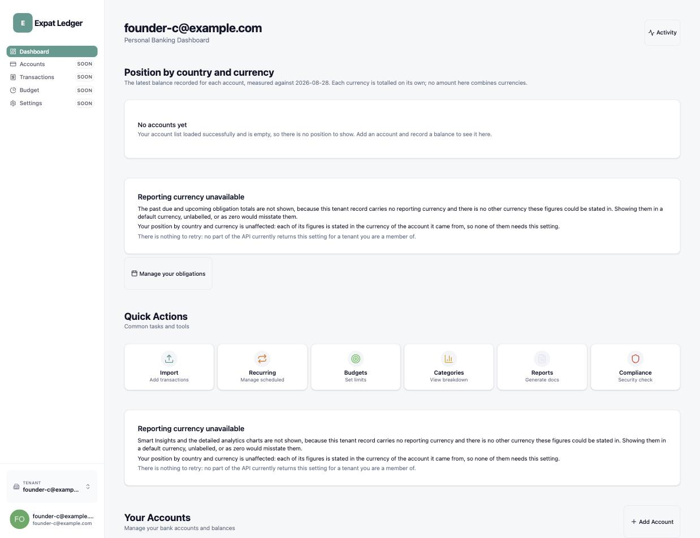

# Founder test re-walk — Start your ledger, end to end

| | |
| --- | --- |
| **Date walked** | 2026-08-28 |
| **Feature** | `start-your-ledger` |
| **Run kind** | Founder test (re-walk) |
| **Protocol** | [expat-ledger-frontend#142](https://github.com/alexandervivas/expat-ledger-frontend/issues/142) |
| **Previous run** | [2026-08-20](../2026-08-20-start-your-ledger-founder-test/index.md) — verdict **No**, nine blockers filed |
| **Environment** | Local stack on macOS, clean `git worktree`, backend fast-forwarded to `e91cd65` (includes backend#235), Auth0 development tenant |
| **Identities** | Synthetic only — reserved `example.com` addresses; three identities used (`founder-b`, `founder-c`, `founder-e`) because two intermediate passwords were generated and not saved before the walker knew a re-login would be needed |

## Verdict

> **Yes, with one new finding** — a new user today can sign up, sign in, sign
> out and sign back in, lands in their own correctly isolated tenant every
> time, and the dashboard is honest about what it does and doesn't know. All
> nine defects and the one backend defect this issue was blocked on are
> confirmed fixed. One new, previously-undiscovered defect was found in this
> walk: two of the three documented corridor bank presets (ABN AMRO and ING,
> both Netherlands) cannot be used at all, because the backend's country model
> never learned the Netherlands exists. Filed as
> [backend#305](https://github.com/alexandervivas/expat-ledger-backend/issues/305)
> and left the issue **open** — #142 does not close until #305 is resolved and
> the flow is walked again.

## What was re-verified from the 2026-08-20 run

Every one of the nine frontend defects and the one backend defect this issue
was blocked on held up under direct re-test:

- **#92** — no landing-page multi-user tenancy or role-based-access claims.
- **#143** — a new user's dashboard is a real empty state, not a full-page
  error; the accounts read no longer gets discarded by an unrelated failing
  read.
- **#144** — no dead sidebar links; every unbuilt route carries an honest
  "SOON" badge instead of a link.
- **#145** — Auth0 redirect errors are surfaced, not silently discarded (the
  live [backend-outage failure](#7-a-live-backend-outage-is-reported-honestly)
  below is the general form of this fix holding).
- **#146** — the primary landing CTA reaches a real sign-up, not "Invite flow
  unavailable".
- **#147** — `localStorage` is completely empty immediately after sign-out
  (verified programmatically, `Object.keys(localStorage)` → `[]`).
- **#148** — landing copy and the reporting-currency picker agree.
- **#150** — the account menu trigger has an accessible name (merged as
  [frontend#212](https://github.com/alexandervivas/expat-ledger-frontend/pull/212)
  the same day as this walk).
- **backend#235** — `GET /v1/transactions` is now routed by the gateway.

Also verified GOOD and not re-litigated from the first run: tenant isolation
(cross-tenant reads return `404`, no enumeration oracle), and AC5 (wrong
password) remains permanently out of scope — authentication is delegated to
Auth0.

## The walk

### 1. Landing page

No finding. The public front door works as documented.

### 2. Sign-up reaches the correct Auth0 screen

No finding — this is `e2e/publicSignUpEntry.e2e.ts` (frontend#146) holding in the
real, deployed tenant, not just against the contract fake.

### 3. Sign-in reaches the correct Auth0 screen

No finding. The two entry points request different things, exactly as the
`e2e` suite asserts.

### 4. Account setup

No finding — recorded to keep the walk continuous, as in the first run.

### 5. A new, previously undiscovered defect: the Netherlands corridor presets are broken

Evidences [backend#305](https://github.com/alexandervivas/expat-ledger-backend/issues/305):
the backend's `CountryCode` domain enum only defines `US`, `CA`, `CO`, `ES` —
`NL` was never added. `POST /v1/banks` with `{"name":"ABN AMRO","countryCode":"NL"}`
fails `400 invalid-request` every time; the identical request shape with
`countryCode: "CO"` (Bancolombia) succeeds immediately. This release is named
**"R1 — ABN Morning Position"**, and the corridor it is named for cannot be
used at all today.

### 6. A populated ledger states honestly what it does not know

No finding — this is the trust vocabulary (ADR-006) working as designed.
Leaving "Balance observed at" empty during setup records no snapshot, by
documented design (README, "The contract position on initial balance and
as-of"), and the dashboard says so in words rather than showing a
zero.

### 7. A live backend outage is reported honestly

No finding — this is #145's fix in its general form: a failed request against
the *real* stack (not the contract fake) is named specifically and offered a
working retry, never presented as silence or a raw error.

### 8. Retry recovers cleanly

No finding. Confirms the retry in the previous frame actually works against
the live stack, not just the contract fake's simulated retry.

## Findings filed from this run

| Finding | Kind | Evidenced by |
| --- | --- | --- |
| [backend#305](https://github.com/alexandervivas/expat-ledger-backend/issues/305) — `NL` is not a supported `CountryCode`; ABN AMRO and ING corridor presets always fail | Defect | 05 |

## What the identity churn means, stated plainly

The walker generated a random password for `founder-b`, did not save it, and
could not sign back in — so `founder-c` was created instead. The same happened
again with `founder-c`. Neither is a product defect: it reflects the walker's
own credential hygiene, not the sign-in flow, and is recorded here rather than
silently smoothed over. The final sign-in-again check (frame 8) succeeded via
an active Auth0 SSO session rather than fresh credential entry — the app's own
sign-out cleared local state correctly (#147, re-verified), but the identity
provider's browser session was still live, so `founder-e`'s re-entry did not
require the login form. This still exercises and confirms the property under
test: a returning user with exactly one existing tenant is routed straight to
`/dashboard`, never back through `/onboarding`.

## Privacy

Every image was reviewed against the
[archive's privacy rules](../../governance/evidence-archive.md#rules) before it
was committed. No real name, email address, balance, account number, or
statement content appears in any of them. **One screenshot from this session
was deliberately excluded**: an early sign-up accidentally went through
"Continue with Google" and landed on a dashboard bearing the walker's real name
and personal email address. It was neither saved to disk nor committed here.
