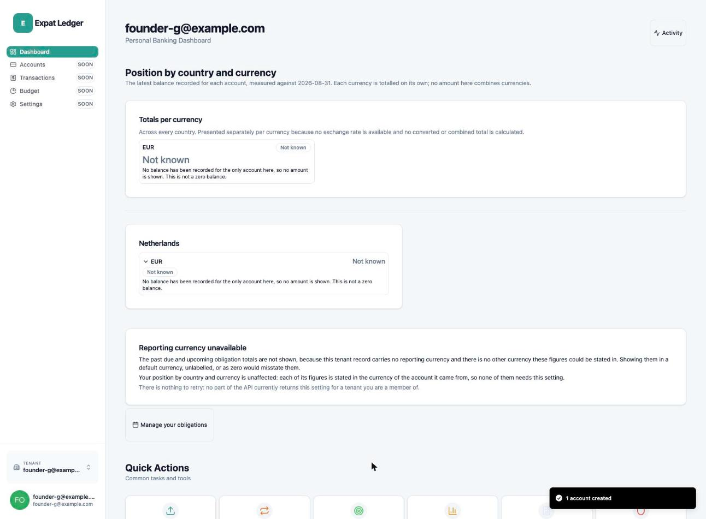
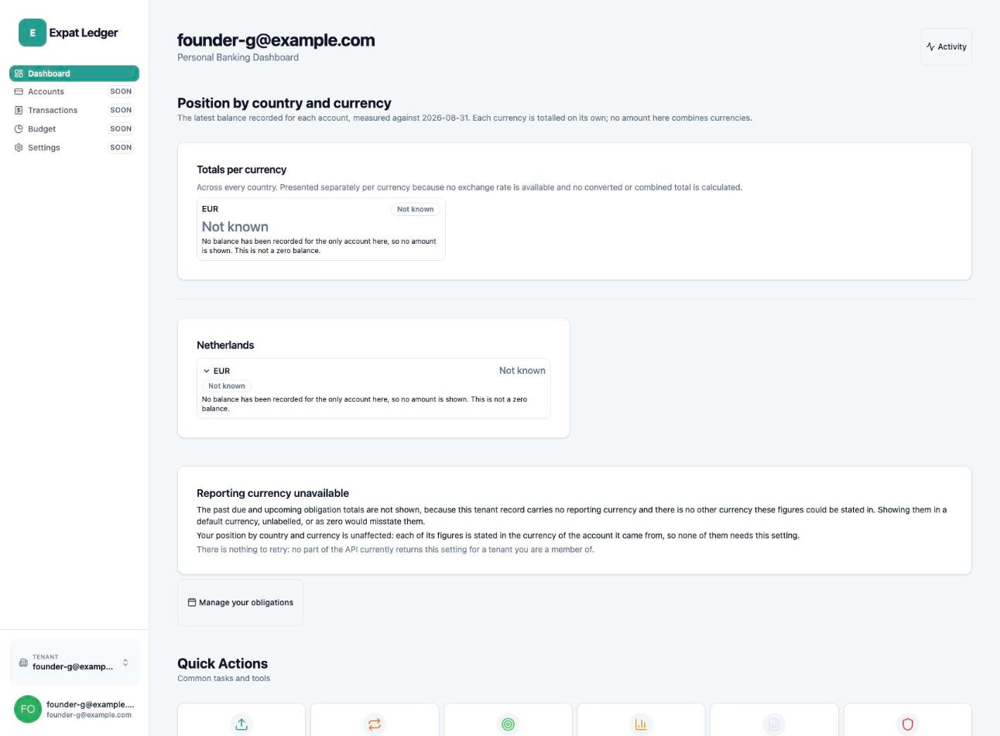

# Founder test — Start your ledger, end to end (clean walk)

| | |
| --- | --- |
| **Date walked** | 2026-08-31 |
| **Feature** | `start-your-ledger` |
| **Run kind** | Founder test (final re-walk) |
| **Protocol** | [expat-ledger-frontend#142](https://github.com/alexandervivas/expat-ledger-frontend/issues/142) |
| **Previous run** | [2026-08-31, earlier the same day](../2026-08-31-start-your-ledger-founder-test-rewalk/index.md) — verdict "yes, with one new finding", backend#308 filed |
| **Environment** | Local stack on macOS, primary checkout (evidence-only, no code change), backend rebuilt fresh from `main` (`61136cc`, includes the backend#308 fix), Auth0 development tenant |
| **Identity** | Synthetic only — `founder-g@example.com`; account creation and password entry performed live by the repo owner, per the standing rule |

## Verdict

> **Yes.** A new user today can sign up, sign in, sign out and sign back in,
> landing in their own correctly isolated tenant every time, and can create a
> real ABN AMRO (NL) account with its actual IBAN
> (`NL91ABNA0417164300`) — no blocker remains. backend#308 (filed earlier
> today) was delivered and merged by another session
> ([backend#311](https://github.com/alexandervivas/expat-ledger-backend/pull/311))
> before this walk began; this walk re-verifies it live rather than trusting
> the merge. All twelve cumulative blockers across three walks
> (frontend#92/143/144/145/146/147/148/150, backend#235/305/308, docs#8) are
> now closed and confirmed working end to end. **#142 is complete.**

## The walk

### 1. The corridor works end to end with a real IBAN

No finding. This is the exact scenario that failed in the
[earlier walk today](../2026-08-31-start-your-ledger-founder-test-rewalk/index.md)
(backend#308) — same bank, same real IBAN, now succeeding.

### 2. Sign out, sign back in

No finding — `localStorage` was verified empty immediately after sign-out
before this screenshot was taken.

## Findings filed from this run

None.

## Privacy

Both images were reviewed against the
[archive's privacy rules](../../governance/evidence-archive.md#rules) before
they were committed. No real name, email address, balance, or statement
content appears in either. The IBAN `NL91ABNA0417164300` used in testing is
ABN AMRO's own publicly documented example/test IBAN, not a real customer
account.
