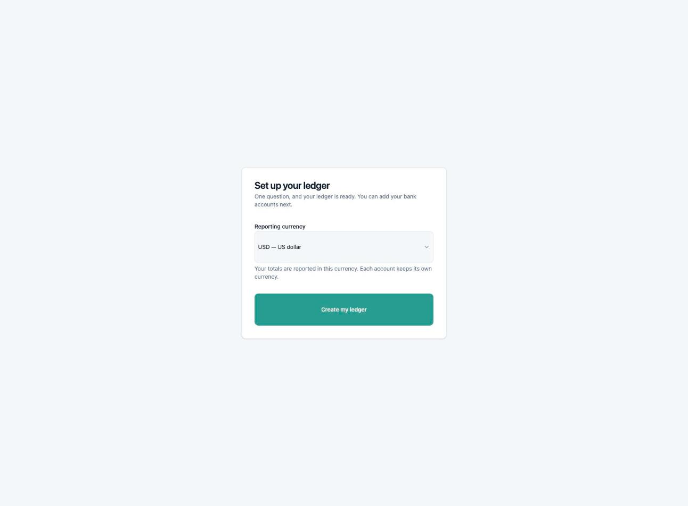
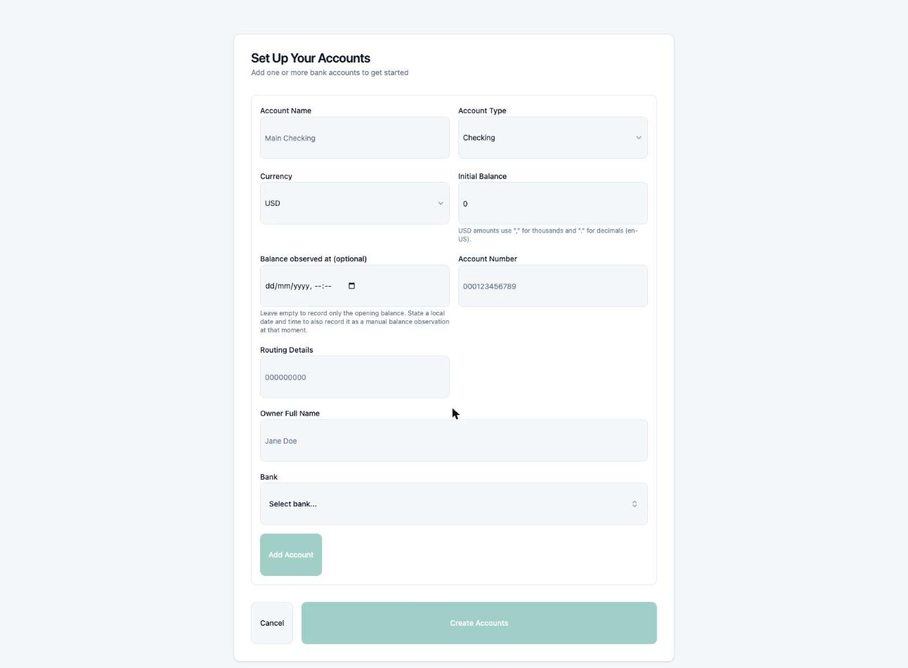
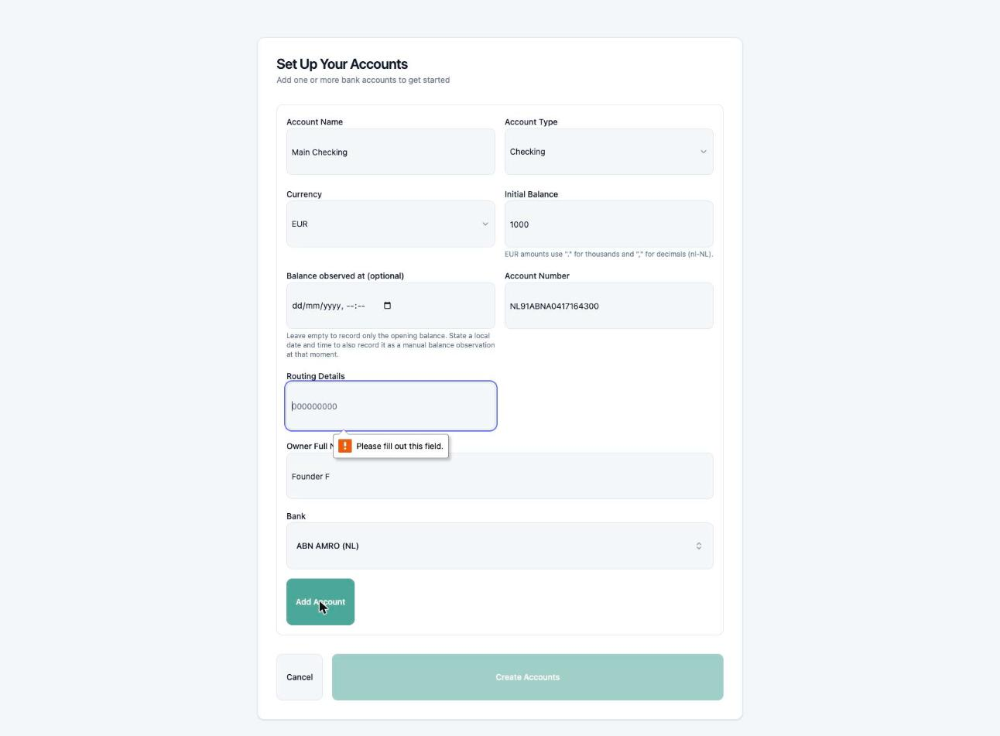
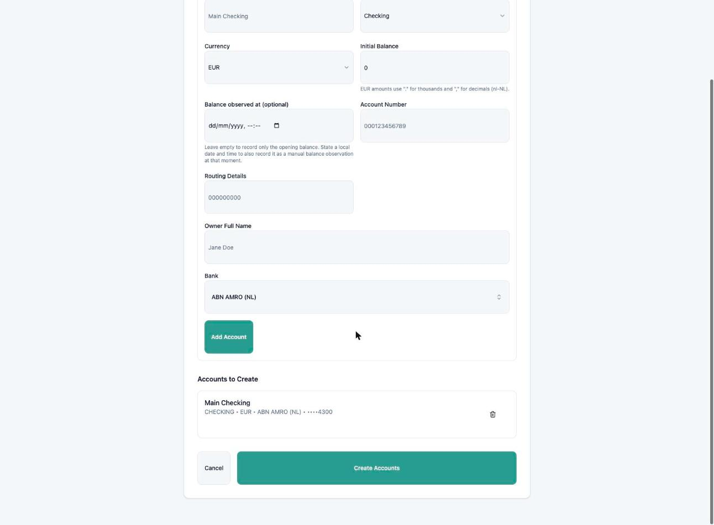
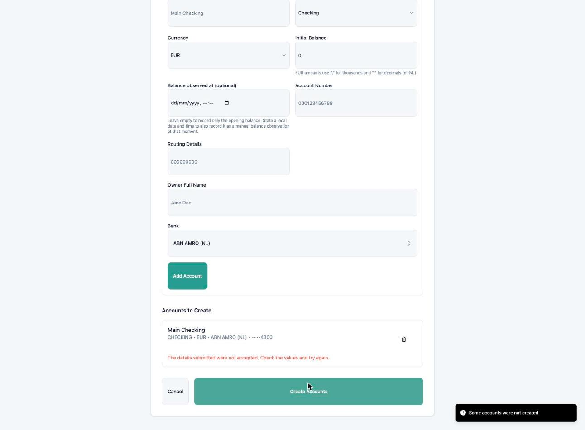
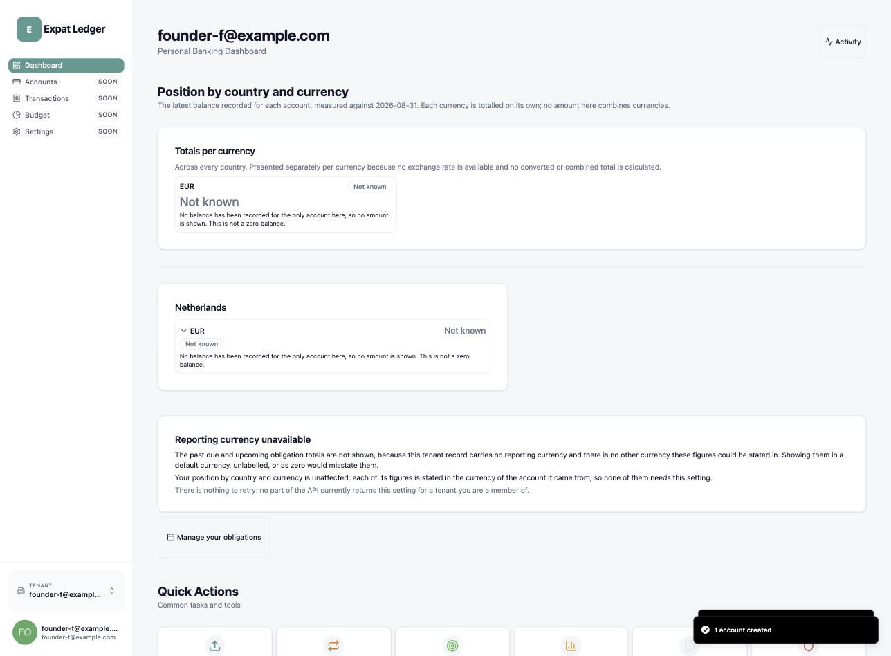
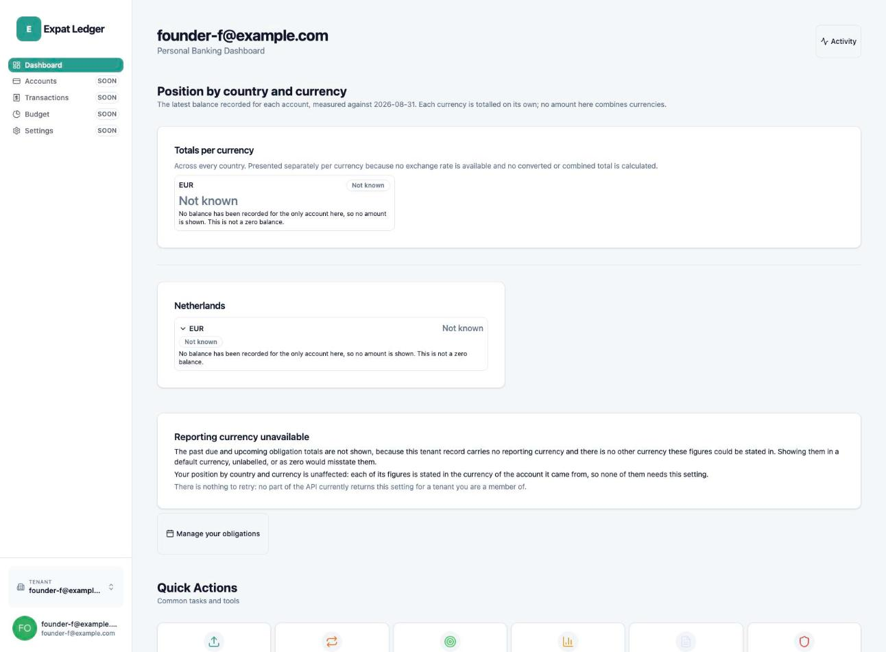

# Founder test re-walk — Start your ledger, end to end

| | |
| --- | --- |
| **Date walked** | 2026-08-31 |
| **Feature** | `start-your-ledger` |
| **Run kind** | Founder test (re-walk) |
| **Protocol** | [expat-ledger-frontend#142](https://github.com/alexandervivas/expat-ledger-frontend/issues/142) |
| **Previous run** | [2026-08-28](../2026-08-28-start-your-ledger-founder-test-rewalk/index.md) — verdict **yes, with one new finding**, backend#305 filed |
| **Environment** | Local stack on macOS, primary checkout (evidence-only, no code change), backend rebuilt fresh from `main` (`2e574c4`, includes the backend#305 fix) via `make up-offline`, Auth0 development tenant |
| **Identity** | Synthetic only — `founder-f@example.com`; account creation and password entry performed live by the repo owner, per the standing rule |

## Verdict

> **Yes, with one new finding** — a new user today can sign up, sign in, sign
> out and sign back in, landing in their own correctly isolated tenant every
> time. backend#305's fix holds: the ABN AMRO (NL) bank preset now creates
> successfully. But the corridor this release is named for is still unusable
> end-to-end — entering a real IBAN as the account number on the very next
> step is rejected every time, because the backend's `AccountNumber` domain
> model only accepts digit-only strings. Filed as
> [backend#308](https://github.com/alexandervivas/expat-ledger-backend/issues/308)
> and left the issue **open** — #142 does not close until #308 is resolved
> and the flow is walked again.

## What was re-verified from the 2026-08-28 run

- Landing page reaches the correct Auth0 screens: `screen_hint=signup` for
  "Create My Ledger", the distinct Log In screen for "Log In".
- A fresh sign-up completes onboarding and account setup end to end.
- Sign-out clears `localStorage` completely
  (`Object.keys(localStorage)` → `[]`, verified programmatically); sign-in
  restores the same tenant with its account intact.
- Currency copy (#148): the landing page's "USD, EUR and COP" claim and the
  onboarding reporting-currency picker's five options (adding GBP, CAD) are a
  deliberate, documented split between `CurrencySchema` (account-open
  currencies) and `ReportingCurrencySchema` (a separate write-only
  preference) — confirmed in `Landing.tsx:22-41`, not a regression.

Tenant isolation and AC5 (wrong password, out of scope — delegated to Auth0)
were not re-litigated: no tenant or auth code changed since the 2026-08-28
walk that last verified them.

## The walk

### 1. Landing page

No finding.

### 2. Onboarding: reporting currency

No finding — this is the intentional split behind #148's fix, re-verified
live rather than re-litigated from the code alone.

### 3. Account setup form

No finding, recorded to keep the walk continuous.

### 4. ABN AMRO (NL) bank creation now succeeds

Confirms backend#305's fix: bank creation for the `NL` corridor no longer
fails.

### 5. A new, previously undiscovered defect: the account itself cannot be created with a real IBAN

Evidences [backend#308](https://github.com/alexandervivas/expat-ledger-backend/issues/308):
`AccountNumber` (`modules/account-service/.../domain/model/AccountNumber.scala`)
only accepts digit-only strings. A Dutch bank account has had no digit-only
identifier since IBAN became mandatory in 2014, so this makes the ABN AMRO/ING
corridor unusable with any real account number — one layer past backend#305.

### 6. Root cause confirmed: the identical form succeeds with a digits-only number

Isolates the defect precisely to the account-number format, not the bank,
currency, or any other field.

### 7. Sign out, sign back in

No finding — `localStorage` was verified empty immediately after sign-out
before this screenshot was taken.

## Findings filed from this run

| Finding | Kind | Evidenced by |
| --- | --- | --- |
| [backend#308](https://github.com/alexandervivas/expat-ledger-backend/issues/308) — `AccountNumber` rejects IBANs, so ABN AMRO/ING (NL) accounts still cannot be created after backend#305 | Defect | 05, 06, 07 |

## Privacy

Every image was reviewed against the
[archive's privacy rules](../../governance/evidence-archive.md#rules) before it
was committed. No real name, email address, balance, real account number, or
statement content appears in any of them. The IBAN `NL91ABNA0417164300` used
in testing is ABN AMRO's own publicly documented example/test IBAN, not a
real customer account.
